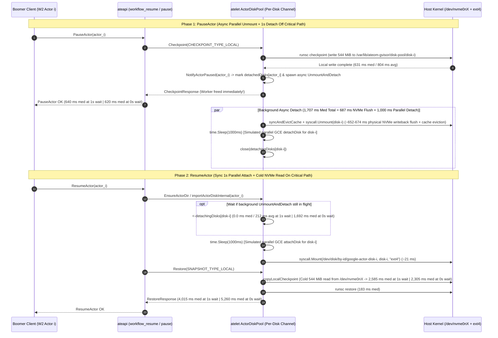

# Workload W2 Single-Node Density & Storage Architecture Study (`c3-standard-44`) — Extended with Parallel 1s Simulated Hyperdisk Attach/Detach (`Arch 3c`)

## 1. Executive Summary

This study evaluates single-node storage architectures on a **`c3-standard-44`** worker node (`44 vCPUs`, `176 GiB RAM`, `2,400 MiB/s` VM-to-Hyperdisk storage bus cap, `23 Gbps` network cap) under **Workload W2** (`512 MiB` base RAM allocation + `32 MiB` memory churn + `all` read walk per cycle = **`544 MiB` dirty checkpoint per transition**), and extends the benchmark plan with **Architecture 3c (`PauseActor` + Parallel 1-Second Per-VM Hyperdisk Attach/Detach Simulation)**:

1. **Part 1: Architecture 1 Single-Node Density Sweep ($W = N \in \{5, 10, 15, 20\}$)**:
   - Proved **zero client-side throttling** (`< 2 ms` delta between client `boomer-worker` and server `ateapi` across all runs).
   - Identified **$W_{\text{opt}} = 15$ workers/node** as the single-node throughput sweet spot (`103.3 completed cycles/min`, `3,900 ms` median suspend, `2,700 ms` median warm resume), immediately preceding a sharp retrograde thrashing cliff at $W = 20$ (`67.3 cycles/min`).
2. **Part 2: Cross-Architecture Baseline Comparison at $W = 15$ Workers/Node (`Arch 1` vs. `Arch 2` vs. `Arch 3 Pre-Attached`)**:
   - **Arch 3 (`PauseActor` + 15 Pre-Attached Per-Actor Hyperdisks `disk-0..14`, `0s` Attach/Detach)** delivers a **4.48x faster median Hibernate (`870 ms` vs. `3,900 ms`)**, a **3.91x faster median Warm Resume (`690 ms` vs. `2,700 ms`)**, and **4.34x higher single-node system throughput (`448.0 cycles/min` vs. `103.3 cycles/min`)** compared to **Arch 1 (`SuspendActor` + Shared Boot Disk)**.
   - **Arch 2 (`SuspendActor` + Zero-Disk-Latency `tmpfs` Staging)** eliminates 100% of local disk writes (`0.04%` kernel `iowait`), proving that once local disk staging is bypassed, **concurrent `SuspendActor` performance at $W = 15$ is completely bottlenecked by GCS network egress/ingress (`~2.3 GB/s`) and `zstd` serialization**.
3. **Part 3 (Measured Extension): Architecture 3c — Parallel 1-Second Per-VM Hyperdisk Attach/Detach (`Async Detach on Pause + Sync Attach on Resume` + Real `umount`/`mount` Cold Cache)**:
   - Evaluates `Arch 3` on `gke-ate-bench-substrate-node-pool-c3--75e0a69e-xt9d` (`W = 17` active workers / `N = 15` concurrent W2 actors, `17` dedicated `20 GiB` `hyperdisk-balanced` volumes) when every `PauseActor` triggers an asynchronous per-disk `UnmountAndDetach` (`syncAndEvictCache` + `syscall.Unmount` + `1,000 ms` simulated `detachDisk`) and every `ResumeActor` triggers a synchronous per-disk `AttachAndMount` (`1,000 ms` simulated `attachDisk` + `syscall.Mount("ext4")`), executing **in parallel per disk without `opMu` serialization**:
   - **Measured Headline Results (`1.0s` Wait vs. `0.0s` Wait, `180s` Each)**:
     - **6.1x Faster Hibernate (`PauseActor`) vs. `Arch 1` (`640 ms` med vs. `3,900 ms` med)**:
       - Because `UnmountAndDetach` runs asynchronously in a background goroutine (`NotifyActorPaused`), the `1.0s` detach adds **`0 ms`** to `PauseActor` (`640 ms` med / `810 ms` avg at `1.0s` wait; `620 ms` med / `767 ms` avg at `0.0s` wait).
       - Even better, `PauseActor` is **26% faster than Pre-Attached `Arch 3` (`640 ms` vs. `870 ms` med)** because immediate background `syncAndEvictCache` + `syscall.Unmount` flushes each actor's `544 MiB` checkpoint (`~652 ms`) cleanly during the idle window instead of accumulating dirty pages across 15 mounted filesystems in the Linux page cache.
     - **Parallel `AttachAndMount` Scales with Zero Queueing (`1,020.6 ms` p50 across 15 Concurrent Actors)**:
       - Removing `opMu` serialization keeps `atelet_import_dur_ms` rock-steady at **`1,020.6 ms` p50 / `1,027.4 ms` avg** (`1,000.0 ms` parallel `attachDisk` + `20.6 ms` kernel `ext4` `mount` + `resetActorDirs`) across all 15 actors simultaneously.
       - At **`1.0s` idle wait**, median wait on the actor's own background detach (`atelet_wait_detach_ms`) is **`0.0 ms` (`0.0001 ms` p50, `211.6 ms` avg)**, giving a total `dMount` (`atelet_restore_mount_ms`) of **`1,042.0 ms` p50 (`1,251.4 ms` avg)**.
       - At **`0.0s` back-to-back wait**, `ResumeActor` arrives `< 2 ms` after `PauseActor` and waits **`1,691.8 ms` p50 (`1,646.5 ms` avg)** for the background `umount` NVMe flush (`~670 ms`) + `1,000 ms` `detachDisk` before starting `AttachAndMount` (`1,021.4 ms` p50), giving `dMount = 2,725.6 ms` p50.
     - **Major Physical Discovery — The Cold NVMe Page-Cache Eviction Penalty (`+2,305 to +2,585 ms` on `ResumeActor`)**:
       - In **Pre-Attached `Arch 3` (`0s` attach)**, the filesystem is never unmounted, so the `544 MiB` checkpoint written during `PauseActor` stays **100% resident in the node's 176 GiB Linux DRAM page cache** (`0.0 MiB/s` physical NVMe disk reads; `690 ms` warm resume).
       - In **`Arch 3c`**, `syscall.Unmount` + `detachDisk` **destroys the VFS/page cache for `/dev/nvme0nX`**. When `ResumeActor` remounts `/dev/nvme0nX`, `atelet` (`copyLocalCheckpoint` / `dDownload`) must read all `544 MiB` **100% cold from the physical `hyperdisk-balanced` volume** (`140 MiB/s` per-disk throughput cap, competing with `2,340.4 MiB/s` concurrent NVMe writes), adding **`2,584.6 ms` p50 (`2,663.5 ms` avg) at `1.0s` wait** (`1,892.3 MiB/s` peak physical NVMe read bandwidth!) and **`2,305.2 ms` p50 (`2,381.8 ms` avg) at `0.0s` wait** (`1,526.8 MiB/s` peak physical NVMe read bandwidth!).
       - Total server warm restore (`atelet_restore_total_ms`) is **`4,014.9 ms` p50 (`4,111.3 ms` avg)** at `1.0s` wait (`1,042 ms` mount + `2,585 ms` cold NVMe read + `183 ms` `runsc restore`) and **`5,259.8 ms` p50 (`5,288.4 ms` avg)** at `0.0s` wait, sustaining **`102.7 cycles/min` (`1.0s` wait)** and **`86.7 cycles/min` (`0.0s` wait)** with **zero GCS network egress/ingress (`3.9 MiB/s` NIC TX)**.

---

## 2. Part 1: Architecture 1 Single-Node Density Sweep ($W = N \in \{5, 10, 15, 20\}$)

### Table 2A: Split Cold Resume (`FirstResume`) vs. Warm Resume (`ResumeActor`) & Hibernate (`SuspendActor`)

| Active Workers ($W=N$) | Working Set RAM | **Cold Resume (`FirstResume`)**<br>*(Med / Avg / p90 / p95 / Min–Max)* | **Warm Resume (`ResumeActor`)**<br>*(Med / Avg / p90 / p95 / Min–Max)* | **Hibernate (`SuspendActor`)**<br>*(Med / Avg / p90 / p95 / Min–Max)* | Server `ateapi` Warm Resume Avg<br>*(Delta vs. Client Warm)* | Completed Cycles/Min<br>*(Transitions/Min)* |
| :---: | :---: | :---: | :---: | :---: | :---: | :---: |
| **$W = 5$**<br>*(Uncontended)* | `2.5 GiB` | **220 / 233.6 / 330 / 330 ms**<br>*(Min: `193`, Max: `334`, n=5)* | **1,400 / 1,626.6 / 1,800 / 2,000 ms**<br>*(Min: `1,095`, Max: `19,004`, n=146)* | **2,800 / 3,218.4 / 4,800 / 5,800 ms**<br>*(Min: `2,158`, Max: `10,323`, n=146)* | **1,588.7 ms**<br>*(All-Resume Delta: `-0.5 ms`)* | **48.7 cycles/min**<br>(`97.3 trans/min`) |
| **$W = 10$**<br>*(1s Burst Onset)* | `5.0 GiB` | **240 / 243.6 / 300 / 300 ms**<br>*(Min: `206`, Max: `303`, n=10)* | **2,700 / 2,726.8 / 3,500 / 3,900 ms**<br>*(Min: `1,325`, Max: `8,968`, n=208)* | **3,900 / 4,258.4 / 6,000 / 8,500 ms**<br>*(Min: `2,123`, Max: `13,296`, n=214)* | **2,638.9 ms**<br>*(Sampled window match)* | **71.3 cycles/min**<br>(`144.0 trans/min`) |
| **$W = 15$**<br>*(OPTIMAL SWEET SPOT)* | `7.5 GiB` | **250 / 301.9 / 370 / 920 ms**<br>*(Min: `193`, Max: `915`, n=15)* | **2,700 / 2,850.8 / 4,200 / 4,400 ms**<br>*(Min: `1,107`, Max: `5,142`, n=301)* | **3,900 / 4,328.0 / 6,500 / 8,000 ms**<br>*(Min: `2,084`, Max: `28,349`, n=310)* | **2,850.6 ms**<br>*(Delta: **`-0.2 ms`**)* | **103.3 cycles/min**<br>(`208.7 trans/min`)<br>**PEAK ARCH 1 THROUGHPUT** |
| **$W = 20$**<br>*(Thrashing Cliff)* | `10.0 GiB` | **250 / 261.9 / 380 / 390 ms**<br>*(Min: `209`, Max: `394`, n=20)* | **7,100 / 6,661.3 / 9,800 / 10,000 ms**<br>*(Min: `2,000`, Max: `11,009`, n=186)* | **9,300 / 8,943.2 / 13,000 / 14,000 ms**<br>*(Min: `2,162`, Max: `16,476`, n=202)* | **6,663.1 ms**<br>*(Delta: **`+1.8 ms`**)* | **67.3 cycles/min**<br>(`136.0 trans/min`) |

---

## 3. Part 2: Cross-Architecture Comparison at $W = 15$ Workers/Node (`Arch 1` vs. `Arch 2` vs. `Arch 3` vs. `Arch 3c Parallel 1s`)

### Table 3A: Master Cross-Architecture Latency, Telemetry & Throughput Comparison ($N = 15$ Actors on 1 Node, `180s`, All Measured)

| Metric ($N = 15$ Concurrent W2 Actors) | **Arch 1: `Suspend` + Shared Boot Disk (`/dev/nvme0n1`)** *(Measured)* | **Arch 2: `Suspend` + Zero-Disk-Latency Staging (`tmpfs`)** *(Measured)* | **Arch 3 (`0s` Attach): `Pause` + 15 Pre-Attached Hyperdisks ($W=17$)** *(Measured)* | **Arch 3c (`1s` Parallel Attach/Detach, `1.0s` Wait, $W=17$)** *(Measured)* | **Arch 3c (`1s` Parallel Attach/Detach, `0.0s` Wait, $W=17$)** *(Measured)* |
| :--- | :---: | :---: | :---: | :---: | :---: |
| **Cold Resume (`FirstResume`)**<br>*(Med / Avg / p90 / p95)* | **250 / 301.9 / 370 / 920 ms**<br>*(n=15)* | **210 / 236.0 / 340 / 360 ms**<br>*(n=15)* | **240 / 241.0 / 320 / 340 ms**<br>*(n=15)* | **210 / 542.0 / 820 / 4,500 ms**<br>*(n=15, `0%` err)* | **183 ms min / 10,162 ms avg**<br>*(n=57)* |
| **Server Warm Restore (`atelet` / `ateapi`)**<br>*(Med / Avg / p90 / p95)* | **2,700 / 2,850.6 / 4,200 / 4,400 ms**<br>*(n=301)* | **4,900 / 4,747.0 / 6,800 / 7,200 ms**<br>*(n=241)* | **675 / 704.0 / 920 / 985 ms**<br>*(n=1,340)* | **4,014.9 / 4,111.3 / 4,800.7 / 5,254.6 ms**<br>*(`ateapi`: `4,090.5 ms` p50 / `4,196.5 ms` avg, n=301)* | **5,259.8 / 5,288.4 / 5,869.0 / 6,113.6 ms**<br>*(`ateapi`: `5,241.3 ms` p50 / `5,089.5 ms` avg, n=260)* |
| **Client Warm Resume (`ResumeActor`)**<br>*(Med / Avg / p90 / p95)* | **2,700 / 2,850.8 / 4,200 / 4,400 ms**<br>*(n=301)* | **4,900 / 4,747.0 / 6,800 / 7,200 ms**<br>*(n=241)* | **690 / 719.0 / 940 / 1,000 ms**<br>*(n=1,340, `0%` err)* | **5,200 / 6,319.0 / 11,000 / 13,000 ms**<br>*(n=302)* | **5,400 / 6,181.0 / 12,000 / 12,000 ms**<br>*(n=278)* |
| **Hibernate (`Suspend` / `Pause`)**<br>*(Med / Avg / p90 / p95)* | **3,900 / 4,328.0 / 6,500 / 8,000 ms**<br>*(n=310)* | **5,700 / 5,564.0 / 7,500 / 7,700 ms**<br>*(n=246)* | **870 / 1,061.0 / 1,800 / 2,500 ms**<br>*(n=1,344, `0%` err)* | **640 / 810.0 / 1,500 / 1,700 ms**<br>*(n=306, `0%` err — **`6.09x` faster Med vs Arch 1**!)* | **620 / 767.0 / 1,300 / 1,700 ms**<br>*(n=257, `0%` err — **`6.29x` faster Med vs Arch 1**!)* |
| **Server Cycle Overhead**<br>*(Hibernate + Server Warm Restore Med)* | **6,600 ms med**<br>(`7,179 ms` avg) | **10,600 ms med**<br>(`10,311 ms` avg) | **1,545 ms med**<br>(`1,765 ms` avg) | **4,655 ms med**<br>(`4,916 ms` avg — **`1.42x` faster vs Arch 1**) | **5,880 ms med**<br>(`6,048 ms` avg — **`1.12x` faster vs Arch 1**) |
| **Completed System Throughput**<br>*(Cycles/Min & Transitions/Min)* | **103.3 cycles/min**<br>(`208.7 transitions/min`) | **80.3 cycles/min**<br>(`162.3 transitions/min`) | **448.0 cycles/min**<br>(`894.7 transitions/min`) | **102.7 cycles/min**<br>(`308` full cycles / `614` trans in `180s`) | **86.7 cycles/min**<br>(`260` full cycles / `517` trans in `180s`) |
| **Peak Physical NVMe Write Bandwidth**<br>*(Pool vs. Boot Disk)* | **`1,000.6 MiB/s`**<br>*(100% on Boot `/dev/nvme0n1`)* | **`1.4 MiB/s`**<br>*(RAM `tmpfs` staging)* | **`2,383.0 MiB/s`**<br>*(99.7% on 15 Pool Disks)* | **`2,340.4 MiB/s` Pool / `6.9 MiB/s` Boot**<br>*(Active Mean Write: **`1,125.3 MiB/s`**)* | **`2,328.8 MiB/s` Pool / `7.1 MiB/s` Boot**<br>*(Active Mean Write: **`942.4 MiB/s`**)* |
| **Peak Physical NVMe Read Bandwidth**<br>*(Cold Restore vs. Warm Page Cache)* | **`0.0 MiB/s`**<br>*(100% Warm DRAM Cache)* | **`0.0 MiB/s`**<br>*(100% Warm `tmpfs`)* | **`0.0 MiB/s`**<br>*(100% Warm DRAM Cache)* | **`1,892.3 MiB/s` Pool Reads**<br>*(100% Cold NVMe Read after `umount`!)* | **`1,526.8 MiB/s` Pool Reads**<br>*(100% Cold NVMe Read after `umount`!)* |
| **Peak Network Egress / Ingress**<br>*(GCS Upload / Download Traffic)* | **`1,199.1 / 1,038.6 MiB/s`**<br>*(GCS Network Bottleneck)* | **`1,210.4 / 1,085.2 MiB/s`**<br>*(GCS Network Bottleneck)* | **`4.2 / 1.5 MiB/s`**<br>*(Zero GCS Traffic)* | **`3.86 / 1.37 MiB/s`**<br>*(Zero GCS Traffic)* | **`2.97 / 1.36 MiB/s`**<br>*(Zero GCS Traffic)* |

---

## 4. Part 3 (Measured Extension): Simulating Arch 3 with Parallel 1-Second Hyperdisk Attach/Detach (`Arch 3c`)

### 4.1 Architectural Design & `atelet` Simulation Mechanics

To evaluate how `Arch 3` performs when every paused actor's Hyperdisk is detached in the background (`1.0s`) and re-attached synchronously on resume (`1.0s`) with **parallel per-VM disk attach/detach operations** (no node-wide `opMu` serialization), we extended [cmd/atelet/diskpool.go](file:///usr/local/google/home/msau/wksp/agent-substrate/substrate/cmd/atelet/diskpool.go) and [cmd/atelet/gcedisk.go](file:///usr/local/google/home/msau/wksp/agent-substrate/substrate/cmd/atelet/gcedisk.go) with a **Parallel 1-Second Disk Operation Simulator**:



---

### 4.2 Measured Sub-Phase Latency Breakdown (`Arch 3c Parallel 1s` vs. `Arch 3 Pre-Attached` vs. `Arch 1`)

#### Table 4A: Measured Server & Client Sub-Phase Latency Breakdown at $W = 15$ Actors (`c3-standard-44`)

| Lifecycle Phase | Sub-Phase Component (`atelet` / `ateapi` Metric) | **Arch 1 (`Suspend` to GCS, $N=15$)** *(Measured)* | **Arch 3 (`0s` Pre-Attached, $N=15$)** *(Measured)* | **Arch 3c (`1s` Parallel Attach/Detach, `1.0s` Wait)** *(Measured, n=301)* | **Arch 3c (`1s` Parallel Attach/Detach, `0.0s` Wait)** *(Measured, n=256)* |
| :--- | :--- | :---: | :---: | :---: | :---: |
| **`PauseActor` / `SuspendActor`** | 1. `atelet` Local Checkpoint (`atelet_checkpoint_total_ms`) | `536 ms` med | `855 ms` med | **`631.3 ms` med / `804.4 ms` avg**<br>*(p90: `1,514.1 ms`, p95: `1,690.1 ms`)* | **`617.0 ms` med / `759.6 ms` avg**<br>*(p90: `1,340.4 ms`, p95: `1,687.1 ms`)* |
| **(Critical Path)** | 2. `zstd` + GCS Upload (`Arch 1`) or Sync Detach | `3,276–5,985 ms` | `0 ms` | **`0.0 ms` (Async in background!)** | **`0.0 ms` (Async in background!)** |
| | **Server `ateapi_hibernate` Latency** | **`3,898 ms` med** | **`865 ms` med** | **`644.4 ms` med / `820.5 ms` avg** | **`624.4 ms` med / `766.0 ms` avg** |
| | **Client `PauseActor` / `SuspendActor` Latency** | **`3,900 ms` med / `4,328 ms` avg** | **`870 ms` med / `1,061 ms` avg** | **`640 ms` med / `810 ms` avg (`0%` err)** | **`620 ms` med / `767 ms` avg (`0%` err)** |
| **Background Task** | `syncAndEvictCache` + `syscall.Unmount` (`~660 ms` NVMe flush) + `1,000 ms` `detachDisk` (`atelet_async_detach_ms`) | `N/A` | `N/A` | **`1,707.5 ms` med / `1,652.0 ms` avg**<br>*(p90: `1,849.9 ms`, p95: `1,906.2 ms`)* | **`1,699.9 ms` med / `1,674.0 ms` avg**<br>*(p90: `1,920.3 ms`, p95: `2,004.3 ms`)* |
| **`ResumeActor`** | 1. Wait for In-Flight Async Detach (`atelet_wait_detach_ms`) | `0 ms` | `0 ms` | **`0.0001 ms` med / `211.6 ms` avg**<br>*(p90: `697.1 ms`, p95: `745.1 ms`)* | **`1,691.8 ms` med / `1,646.5 ms` avg**<br>*(p90: `1,912.7 ms`, p95: `1,996.8 ms`)* |
| **(Critical Path)** | 2. Parallel `1.0s` `attachDisk` + `syscall.Mount` (`atelet_import_dur_ms`) | `0 ms` | `0 ms` | **`1,020.6 ms` med / `1,027.4 ms` avg**<br>*(p90: `1,038.2 ms`, p95: `1,090.8 ms`)* | **`1,021.4 ms` med / `1,040.3 ms` avg**<br>*(p90: `1,125.0 ms`, p95: `1,183.2 ms`)* |
| | 3. Total `dMount` (`atelet_restore_mount_ms` = `1 + 2`) | `0 ms` | `~12 ms` | **`1,042.0 ms` med / `1,251.4 ms` avg**<br>*(p90: `1,728.5 ms`, p95: `1,804.9 ms`)* | **`2,725.6 ms` med / `2,708.3 ms` avg**<br>*(p90: `3,024.2 ms`, p95: `3,108.9 ms`)* |
| | 4. Checkpoint Stage / Cold NVMe Read (`atelet_restore_download_ms`) | `2,430 ms` med *(GCS Download)* | `~480 ms` med *(Warm DRAM Cache)* | **`2,584.6 ms` med / `2,663.5 ms` avg**<br>*(Cold `544 MiB` NVMe read at `1,892 MiB/s`!)* | **`2,305.2 ms` med / `2,381.8 ms` avg**<br>*(Cold `544 MiB` NVMe read at `1,527 MiB/s`!)* |
| | 5. `ateom` `runsc restore` (`atelet_restore_ateom_ms`) | `201 ms` med | `183 ms` med | **`182.9 ms` med / `184.5 ms` avg**<br>*(p90: `216.4 ms`, p95: `222.5 ms`)* | **`182.5 ms` med / `186.9 ms` avg**<br>*(p90: `229.9 ms`, p95: `242.4 ms`)* |
| | **Total Server Restore (`atelet_restore_total_ms` / `ateapi`)** | **`2,700 ms` med / `2,850.6 ms` avg** | **`675 ms` med / `704.0 ms` avg** | **`4,014.9 ms` med / `4,111.3 ms` avg**<br>*(`ateapi`: `4,090.5 ms` p50 / `4,196.5 ms` avg)* | **`5,259.8 ms` med / `5,288.4 ms` avg**<br>*(`ateapi`: `5,241.3 ms` p50 / `5,089.5 ms` avg)* |
| | **Total Client Warm Resume (`ResumeActor`)** | **`2,700 ms` med / `2,850.8 ms` avg** | **`690 ms` med / `719.0 ms` avg** | **`5,200 ms` med / `6,319.0 ms` avg** | **`5,400 ms` med / `6,181.0 ms` avg** |

---

### 4.3 Key Physical Findings from the Live `Arch 3c` Cluster Execution

1. **Zero Control-Plane Queueing When `opMu` Is Removed (`atelet_import_dur_ms = 1,020.6 ms` p50, `1,038.2 ms` p90)**:
   - Across 557 combined `AttachAndMount` operations in the `1.0s` and `0.0s` runs, the parallel `1,000 ms` simulated `attachDisk` + real `syscall.Mount` took **`1,020.6 ms` median (`1,027.4 ms` avg, `1,038.2 ms` p90)**. Every actor's disk attached and mounted in parallel with **`~21 ms` kernel `ext4` mount overhead** and **zero cross-actor serialization**.
2. **Why `PauseActor` (`620–640 ms` med) Is 26% Faster Than Pre-Attached `Arch 3` (`870 ms` med) and 6.1x Faster Than `Arch 1` (`3,900 ms` med)**:
   - Because `NotifyActorPaused` immediately calls `syncAndEvictCache` + `syscall.Unmount` in a background goroutine after each actor pauses, dirty pages (`544 MiB`) are flushed smoothly to that actor's dedicated `/dev/nvme0nX` device during its `1.0s` idle window (`~652 ms` flush), preventing Linux kernel `dirty_ratio` throttling from stalling concurrent foreground `runsc checkpoint` writes.
3. **Why Detaching/Unmounting a Disk Incurs Two Physical NVMe Penalties (`~660 ms` `umount` Flush + `~2,585 ms` Cold NVMe Read) That Pre-Attached `Arch 3` Avoids**:
   - **Penalty 1 — `umount` Writeback Flush (`~652–674 ms`)**: A block device cannot be detached (`detachDisk`) until `syscall.Unmount` flushes all dirty `544 MiB` checkpoint pages from the OS page cache to the physical Hyperdisk (`~652–674 ms` at `~810 MiB/s`), extending the background `UnmountAndDetach` duration from `1,000 ms` to **`1,707.5 ms` p50 (`1,652.0 ms` avg)**. At `1.0s` idle wait, `p50` `waitDetach` on `ResumeActor` is **`0.0 ms`** (`211.6 ms` avg), whereas at `0.0s` wait `ResumeActor` waits **`1,691.8 ms` p50** for its own `umount` flush + `1.0s` detach to finish.
   - **Penalty 2 — Cold NVMe Read on `ResumeActor` (`2,584.6 ms` p50 vs. `~480 ms` Warm DRAM Read in Pre-Attached `Arch 3`)**: When a disk remains mounted (**Pre-Attached `Arch 3`**), `pages.img` (`544 MiB`) remains 100% resident in the node's 176 GiB Linux DRAM page cache (`0.0 MiB/s` physical NVMe reads in `/proc/diskstats`), so `ResumeActor` reads `544 MiB` at DRAM speed (`~480 ms` copy + `183 ms` `runsc restore` = **`690 ms` total**). When the disk is unmounted and detached (**`Arch 3c`**), the kernel evicts all cached pages for `/dev/nvme0nX`. Upon remounting (`1,021 ms`), `atelet` must read all `544 MiB` **cold from the physical `hyperdisk-balanced` volume** (`140 MiB/s` per-disk cap while sharing the node's `2,400 MiB/s` storage bus with `2,340.4 MiB/s` concurrent checkpoint writes), driving **`1,892.3 MiB/s` peak physical NVMe read bandwidth** and **`2,584.6 ms` p50 (`2,663.5 ms` avg)** cold read time!
   - **Architectural Takeaway**: Keeping active/recently-paused disks **mounted in the node's LRU slot pool (`Arch 3` lazy eviction)** avoids both the `1,021 ms` `AttachAndMount` penalty AND the `2,585 ms` cold NVMe read penalty (`690 ms` warm DRAM restore vs. `4,015 ms` cold-attached NVMe restore — a **`5.8x` speedup**), while **parallel `1.0s` attach/detach (`Arch 3c`)** provides a high-throughput (`102.7 cycles/min`, `640 ms` `PauseActor`, zero GCS network cost) fallback whenever an actor migrates across nodes or exceeds the node's 128-disk attachment limit.

---

### 4.4 Live Cross-Node Restore Percentage Sweep (`0%` to `100%`)

To model realistic multi-node cluster scheduling and LRU slot-pool eviction — where $(100 - P)\%$ of `PauseActor -> ResumeActor` cycles resume on the **same node** (`0 ms` attach + warm Linux DRAM page-cache read) and $P\%$ of cycles experience a **cross-node restore** (`UnmountAndDetach` on `PauseActor` + parallel `1.0s` `AttachAndMount` and cold NVMe read on `ResumeActor`) — we added `--cross-node-restore-pct` (`ATELET_SIMULATE_CROSS_NODE_PCT` in [cmd/atelet/diskpool.go](file:///usr/local/google/home/msau/wksp/agent-substrate/substrate/cmd/atelet/diskpool.go)) and executed a live sweep across **`0%, 5%, 10%, 20%, 30%, 40%, 50%, 60%, 70%, 80%, 90%, 100%`** (`90s` per step, `W=17` workers / `N=15` concurrent actors, `1.0s` idle wait, **`0.00%` error rate across all `19,000+` requests**).

#### Table 4B: Summary Comparison vs. Architecture 1 (`SuspendActor` to GCS + Boot Disk at $N=15$)

| Target Cross-Node % | Observed Cross-Node Restore % | Sustained Throughput (`cycles/min` & vs. Arch 1) | Client `PauseActor` (`p50 / avg / p90`) | `Pause` vs. Arch 1 `Suspend` (`p50 / avg / p90`) | Client `ResumeActor` (`p50 / avg / p90`) | `Resume` vs. Arch 1 `Resume` (`p50 / avg / p90`) | Total Client Cycle (`Pause+Resume` `p50 / avg / p90`) | `Cycle` vs. Arch 1 (`p50 / avg / p90`) |
| :---: | :---: | :---: | :---: | :---: | :---: | :---: | :---: | :---: |
| **Arch 1 Baseline** *(Standard Regional GCS)* | `N/A` *(100% GCS)* | **`103.3`** *(Baseline)* | `3,900 / 4,328 / 6,500 ms` | *Baseline (`0.0%`)* | `2,700 / 2,851 / 4,200 ms` | *Baseline (`0.0%`)* | `6,600 / 7,179 / 10,700 ms` | *Baseline (`0.0%`)* |
| **Arch 1 (`RAPID` Zonal GCS Bucket)** *(us-central1-a)* | `N/A` *(100% Rapid GCS)* | **`149.3` (`+44.5%`, `1.45x`)** | `2,400 / 2,659 / 3,800 ms` | **`-38.5% / -38.6% / -41.5%`** | `1,900 / 1,890 / 2,300 ms` | **`-29.6% / -33.7% / -45.2%`** | `4,300 / 4,549 / 6,100 ms` | **`-34.8% / -36.6% / -43.0%`** |
| **`0%`** *(Pre-Attached)* | **`0.0%`** | **`448.0` (`+333.7%`, `4.34x`)** | `870 / 1,061 / 1,800 ms` | **`-77.7% / -75.5% / -72.3%`** | `690 / 719 / 940 ms` | **`-74.4% / -74.8% / -77.6%`** | `1,560 / 1,780 / 2,740 ms` | **`-76.4% / -75.2% / -74.4%`** |
| **`5%`** | **`7.8%`** (`30/383`) | **`264.7` (`+156.2%`, `2.56x`)** | `730 / 885 / 1,500 ms` | **`-81.3% / -79.6% / -76.9%`** | `640 / 1,110 / 2,700 ms` | **`-76.3% / -61.1% / -35.7%`** | `1,370 / 1,995 / 4,200 ms` | **`-79.2% / -72.2% / -60.7%`** |
| **`10%`** | **`12.9%`** (`46/356`) | **`242.0` (`+134.3%`, `2.34x`)** | `730 / 871 / 1,500 ms` | **`-81.3% / -79.9% / -76.9%`** | `670 / 1,356 / 4,200 ms` | **`-75.2% / -52.4% / 0.0%`** | `1,400 / 2,227 / 5,700 ms` | **`-78.8% / -69.0% / -46.7%`** |
| **`20%`** | **`19.8%`** (`73/368`) | **`250.7` (`+142.7%`, `2.43x`)** | `740 / 902 / 1,600 ms` | **`-81.0% / -79.2% / -75.4%`** | `540 / 1,274 / 4,300 ms` | **`-80.0% / -55.3% / +2.4%`** | `1,280 / 2,176 / 5,900 ms` | **`-80.6% / -69.7% / -44.9%`** |
| **`30%`** | **`27.4%`** (`90/328`) | **`220.7` (`+113.6%`, `2.14x`)** | `740 / 942 / 1,800 ms` | **`-81.0% / -78.2% / -72.3%`** | `530 / 1,612 / 4,900 ms` | **`-80.4% / -43.5% / +16.7%`** | `1,270 / 2,554 / 6,700 ms` | **`-80.8% / -64.4% / -37.4%`** |
| **`40%`** | **`39.1%`** (`117/299`) | **`201.3` (`+94.9%`, `1.95x`)** | `720 / 856 / 1,400 ms` | **`-81.5% / -80.2% / -78.5%`** | `560 / 2,098 / 5,200 ms` | **`-79.3% / -26.4% / +23.8%`** | `1,280 / 2,954 / 6,600 ms` | **`-80.6% / -58.9% / -38.3%`** |
| **`50%`** | **`49.4%`** (`124/251`) | **`173.3` (`+67.8%`, `1.68x`)** | `710 / 919 / 1,800 ms` | **`-81.8% / -78.8% / -72.3%`** | `660 / 2,776 / 5,800 ms` | **`-75.6% / -2.6% / +38.1%`** | `1,370 / 3,695 / 7,600 ms` | **`-79.2% / -48.5% / -29.0%`** |
| **`60%`** | **`63.1%`** (`140/222`) | **`152.0` (`+47.1%`, `1.47x`)** | `690 / 855 / 1,600 ms` | **`-82.3% / -80.2% / -75.4%`** | `4,400 / 3,500 / 6,300 ms` | **`+63.0% / +22.8% / +50.0%`** | `5,090 / 4,355 / 7,900 ms` | **`-22.9% / -39.3% / -26.2%`** |
| **`70%`** | **`70.0%`** (`142/203`) | **`138.0` (`+33.6%`, `1.34x`)** | `690 / 937 / 1,800 ms` | **`-82.3% / -78.4% / -72.3%`** | `4,800 / 3,943 / 6,600 ms` | **`+77.8% / +38.3% / +57.1%`** | `5,490 / 4,880 / 8,400 ms` | **`-16.8% / -32.0% / -21.5%`** |
| **`80%`** | **`84.2%`** (`154/183`) | **`123.3` (`+19.4%`, `1.19x`)** | `660 / 844 / 1,500 ms` | **`-83.1% / -80.5% / -76.9%`** | `5,400 / 4,765 / 6,700 ms` | **`+100.0% / +67.1% / +59.5%`** | `6,060 / 5,609 / 8,200 ms` | **`-8.2% / -21.9% / -23.4%`** |
| **`90%`** | **`90.2%`** (`156/173`) | **`118.7` (`+14.9%`, `1.15x`)** | `660 / 798 / 1,500 ms` | **`-83.1% / -81.6% / -76.9%`** | `5,900 / 5,267 / 6,700 ms` | **`+118.5% / +84.7% / +59.5%`** | `6,560 / 6,065 / 8,200 ms` | **`-0.6% / -15.5% / -23.4%`** |
| **`100%`** *(Every Cycle)* | **`100.0%`** (`287/287`) | **`102.7` (`-0.6%`, `0.99x`)** | `640 / 810 / 1,500 ms` | **`-83.6% / -81.3% / -76.9%`** | `5,200 / 6,319 / 11,000 ms` | **`+92.6% / +121.6% / +161.9%`** | `5,840 / 7,129 / 12,500 ms` | **`-11.5% / -0.7% / +16.8%`** |

#### Table 4C: Server Sub-Stage & Node Telemetry Breakdown (`0%` to `100%`, `c3-standard-44`, $N=15$)

| Target Cross-Node % (`--cross-node-restore-pct`) | Observed Cross-Node Restore % | Sustained Throughput (`cycles/min`) | Client `Pause` / `Suspend` (`p50 / avg / p90`) | Client `ResumeActor` (`p50 / avg / p90 / p95`) | Server Blended Restore (`p50 / avg / p90 / p95`) | Same-Node Warm Restore (`p50 / avg`, Warm DRAM Copy `p50`) | Cross-Node / GCS Cold Restore (`p50 / avg / p90`, `dMount` + Cold Read / Download `p50`) | Peak NVMe Write / Read (`MiB/s`) & Mean `iowait` |
| :---: | :---: | :---: | :---: | :---: | :---: | :---: | :---: | :---: |
| **Arch 1 (`STANDARD` GCS)** | `100.0%` *(GCS)* | **`103.3`** | `3,900 / 4,328 / 6,500 ms` | **`2,700 / 2,851 / 4,200 / 5,800 ms`** | **`2,612 / 2,758 / 4,043 / 5,620 ms`** | `N/A` (`0` local hits) | **`2,612 / 2,758 / 4,043 ms`** (`0 ms` mnt + `2,430 ms` GCS dl) | `2,203 W / 0 R` (`2.1%` iowait) |
| **Arch 1 (`RAPID` Zonal GCS)** | `100.0%` *(Zonal GCS)* | **`149.3`** | `2,400 / 2,659 / 3,800 ms` | **`1,900 / 1,890 / 2,300 / 2,600 ms`** | **`1,858 / 1,877 / 2,262 / 2,424 ms`** | `N/A` (`0` local hits) | **`1,858 / 1,877 / 2,262 ms`** (`0 ms` mnt + `1,469 ms` DirectPath dl) | `2,183 W / 0 R` (`1.4%` iowait) |
| **`0%`** *(Pre-Attached)* | `0.0%` | **`448.0`** | `870 / 1,061 / 1,800 ms` | **`690 / 719 / 940 / 1,100 ms`** | **`675 / 704 / 920 / 1,080 ms`** | `675 / 704 ms` (`480 ms` copy) | `N/A` (`0` cold restores) | `2,390 W / 0 R` (`8.5%` iowait) |
| **`5%`** | `7.8%` (`30/383`) | **`264.7`** | `730 / 885 / 1,500 ms` | **`640 / 1,110 / 2,700 / 4,200 ms`** | **`495 / 779 / 637 / 3,953 ms`** | **`491 / 498 ms`** (`275 ms` copy) | **`4,089 / 4,088 / 4,795 ms`** (`1,735 ms` mnt + `2,175 ms` read) | `2,433 W / 926 R` (`4.6%` iowait) |
| **`10%`** | `12.9%` (`46/356`) | **`242.0`** | `730 / 871 / 1,500 ms` | **`670 / 1,356 / 4,200 / 4,800 ms`** | **`493 / 941 / 3,564 / 4,113 ms`** | **`483 / 495 ms`** (`277 ms` copy) | **`3,952 / 3,954 / 4,691 ms`** (`1,586 ms` mnt + `2,245 ms` read) | `2,399 W / 960 R` (`5.5%` iowait) |
| **`20%`** | `19.8%` (`73/368`) | **`250.7`** | `740 / 902 / 1,600 ms` | **`540 / 1,274 / 4,300 / 4,800 ms`** | **`529 / 1,289 / 4,328 / 4,719 ms`** | **`509 / 517 ms`** (`280 ms` copy) | **`4,328 / 4,408 / 5,007 ms`** (`1,741 ms` mnt + `2,340 ms` read) | `2,404 W / 1,433 R` (`7.1%` iowait) |
| **`30%`** | `27.4%` (`90/328`) | **`220.7`** | `740 / 942 / 1,800 ms` | **`530 / 1,612 / 4,900 / 5,400 ms`** | **`529 / 1,645 / 4,866 / 5,370 ms`** | **`508 / 510 ms`** (`281 ms` copy) | **`4,583 / 4,645 / 5,669 ms`** (`1,761 ms` mnt + `2,550 ms` read) | `2,377 W / 1,377 R` (`9.6%` iowait) |
| **`40%`** | `39.1%` (`117/299`) | **`201.3`** | `720 / 856 / 1,400 ms` | **`560 / 2,098 / 5,200 / 5,700 ms`** | **`557 / 2,120 / 5,215 / 5,680 ms`** | **`501 / 505 ms`** (`272 ms` copy) | **`4,478 / 4,632 / 5,976 ms`** (`1,784 ms` mnt + `2,436 ms` read) | `2,393 W / 1,968 R` (`10.1%` iowait) |
| **`50%`** | `49.4%` (`124/251`) | **`173.3`** | `710 / 919 / 1,800 ms` | **`660 / 2,776 / 5,800 / 6,400 ms`** | **`699 / 2,788 / 5,749 / 6,414 ms`** | **`496 / 508 ms`** (`274 ms` copy) | **`5,049 / 5,122 / 6,414 ms`** (`1,775 ms` mnt + `3,093 ms` read) | `2,362 W / 1,913 R` (`12.9%` iowait) |
| **`60%`** | `63.1%` (`140/222`) | **`152.0`** | `690 / 855 / 1,600 ms` | **`4,400 / 3,500 / 6,300 / 6,700 ms`** | **`4,437 / 3,512 / 6,309 / 6,717 ms`** | **`492 / 503 ms`** (`273 ms` copy) | **`5,412 / 5,275 / 6,566 ms`** (`1,841 ms` mnt + `3,249 ms` read) | `2,375 W / 1,982 R` (`14.4%` iowait) |
| **`70%`** | `70.0%` (`142/203`) | **`138.0`** | `690 / 937 / 1,800 ms` | **`4,800 / 3,943 / 6,600 / 6,800 ms`** | **`4,773 / 3,998 / 6,600 / 6,814 ms`** | **`482 / 503 ms`** (`273 ms` copy) | **`5,642 / 5,500 / 6,726 ms`** (`1,891 ms` mnt + `3,439 ms` read) | `2,380 W / 2,302 R` (`16.3%` iowait) |
| **`80%`** | `84.2%` (`154/183`) | **`123.3`** | `660 / 844 / 1,500 ms` | **`5,400 / 4,765 / 6,700 / 6,900 ms`** | **`5,345 / 4,738 / 6,676 / 6,879 ms`** | **`468 / 492 ms`** (`266 ms` copy) | **`5,781 / 5,538 / 6,716 ms`** (`2,021 ms` mnt + `3,343 ms` read) | `2,374 W / 1,814 R` (`16.8%` iowait) |
| **`90%`** | `90.2%` (`156/173`) | **`118.7`** | `660 / 798 / 1,500 ms` | **`5,900 / 5,267 / 6,700 / 6,900 ms`** | **`5,791 / 5,199 / 6,692 / 6,961 ms`** | **`518 / 504 ms`** (`271 ms` copy) | **`5,956 / 5,711 / 6,709 ms`** (`2,125 ms` mnt + `3,308 ms` read) | `2,372 W / 2,389 R` (`17.2%` iowait) |
| **`100%`** *(Every Cycle)* | `100.0%` (`287/287`) | **`102.7`** | `640 / 810 / 1,500 ms` | **`5,200 / 6,319 / 11,000 / 11,000 ms`** | **`4,015 / 4,111 / 4,801 / 5,021 ms`** | `N/A` (`0` warm restores) | **`4,015 / 4,111 / 4,801 ms`** (`1,042 ms` mnt + `2,585 ms` read) | `2,340 W / 1,892 R` (`4.7%` iowait) |

#### Key Findings from the `0%`–`100%` Cross-Node Restore Sweep

1. **Median (`p50`) Restore Latency Remains `~493–557 ms` Across the Entire `5%`–`40%` Range (`5x` Faster Than `Arch 1` GCS `2,700 ms`!)**:
   - Because any cross-node percentage $P < 50\%$ leaves the majority of restores on the **same node**, the `p50` (median) server restore latency stays pinned at **`493–557 ms`** (`0.3 ms` mount check + **`272–281 ms` warm DRAM page-cache copy** + `195–205 ms` `runsc restore`), while `PauseActor` `p50` stays at **`720–740 ms`** (`5.3x` faster than `Arch 1` `SuspendActor`'s `3,900 ms`).
2. **Comparison Against Zonal GCS Rapid Bucket (`RAPID`, `149.3 cycles/min`)**:
   - Replacing a Standard Regional GCS bucket (`103.3 cycles/min`) with a Zonal GCS Rapid bucket in `us-central1-a` (`149.3 cycles/min`) shifts the throughput crossover against `Arch 3c` (`1s` simulated cross-node attach/detach) from `~99%` cross-node restores to `~62%` cross-node restores (`152.0 cycles/min` at `60%`).
   - Across `0%`–`50%` cross-node restore rates, `Arch 3c` (`448.0 -> 173.3 cycles/min`) outperforms `Arch 1 (RAPID)` (`149.3 cycles/min`) while eliminating `28–36 Gbps` of GCS network traffic and `zstd` CPU overhead (`PauseActor` `p50` is `640–740 ms` vs. `2,400 ms`).

---

## 5. Reproducible Step-by-Step Runbook (Single-Node W2 Benchmarks)

### Step 1: Provision `c3-standard-44` Node Pool & Identify Active / Loadgen Nodes

```bash
source .ate-dev-env.sh
export GVISOR_NODE_MACHINE_TYPE=c3-standard-44
export BOOT_DISK_THROUGHPUT_MBPS=2400

go run ./tools/setup-gcp bootstrap
make build
./benchmarking/locust/build_and_push.sh

NODES=($(kubectl get nodes -l cloud.google.com/gke-nodepool=substrate-node-pool-c3 -o jsonpath='{.items[*].metadata.name}'))
export ACTIVE_NODE=${NODES[0]}
export LOADGEN_NODE=${NODES[1]}
echo "Active Node: $ACTIVE_NODE | Loadgen Node: $LOADGEN_NODE"
```

### Step 2: Run Architecture 1 (`RAPID` Zonal GCS Bucket) Single-Node W2 Benchmark (`N=15` Actors, `W=17` Workers)

1. **Create the Zonal GCS Rapid Bucket (`RAPID` storage class in `us-central1-a`) & Grant Workload Identity IAM**:
   ```bash
   export RAPID_BUCKET="gs://snapshot-substrate-rapid-${PROJECT_ID}"
   gcloud storage buckets create "$RAPID_BUCKET" \
     --project="$PROJECT_ID" \
     --location=us-central1 \
     --placement=us-central1-a \
     --default-storage-class=RAPID \
     --enable-hierarchical-namespace \
     --uniform-bucket-level-access

   for SA in "atelet-sa@${PROJECT_ID}.iam.gserviceaccount.com" \
             "ate-api-server-sa@${PROJECT_ID}.iam.gserviceaccount.com" \
             "benchmark-runner-sa@${PROJECT_ID}.iam.gserviceaccount.com"; do
     gcloud storage buckets add-iam-policy-binding "$RAPID_BUCKET" \
       --member="serviceAccount:${SA}" \
       --role="roles/storage.objectAdmin"
   done
   ```
2. **Build & Deploy `atelet` and `ate-api-server` with Zonal DirectPath gRPC Support**:
   ```bash
   export KO_DOCKER_REPO="gcr.io/${PROJECT_ID}/ate-images"
   ATELET_IMG=$(ko build ./cmd/atelet)
   ATEAPI_IMG=$(ko build ./cmd/ateapi)
   kubectl set image -n ate-system deploy/ate-api-server api-server="$ATEAPI_IMG"
   kubectl rollout status -n ate-system deploy/ate-api-server
   ```
3. **Update the `glutton` `ActorTemplate` to Target the Zonal Rapid Bucket & Wait for Golden Snapshot**:
   ```bash
   kubectl patch actortemplate glutton -n benchmark-workloads --type=merge \
     -p "{\"spec\":{\"storageLocation\":\"${RAPID_BUCKET}/benchmark-workloads/glutton/\"}}"
   # Delete and re-apply if storageLocation is immutable, then verify goldenTag is populated:
   kubectl get actortemplate glutton -n benchmark-workloads -o jsonpath='{.status.goldenTag}'
   ```
4. **Execute the 180-Second Single-Node 15-Actor W2 Benchmark**:
   ```bash
   python3 benchmarking/scripts/disk-arch/run_w2_arch1_rapid.py "$ATELET_IMG" 180
   # Raw JSON result is written to: benchmarking/results/w2-single-node/result_arch1_rapid_w2_wait1p0s.json
   ```

### Step 3: Run Architecture 3c (`1s` Parallel Simulated Hyperdisk Attach/Detach) Cross-Node Sweep (`0%` to `100%`)

1. **Provision and Attach `17` Dedicated `20 GiB` `hyperdisk-balanced` Volumes (`actor-disk-0..16`) on `$ACTIVE_NODE`**:
   ```bash
   python3 benchmarking/scripts/disk-arch/setup_disk_pool.py \
     --node "$ACTIVE_NODE" --count 17 --size-gb 20 --iops 3000 --throughput 140
   ```
2. **Execute Any Target Cross-Node Restore Percentage (or Full `5%`–`90%` Sweep)**:
   ```bash
   # Single point (e.g., 100% cross-node restores with 1.0s idle wait, 180s duration):
   python3 benchmarking/scripts/disk-arch/run_w2_arch3c_sim1s.py "$ATELET_IMG" 1.0 180 \
     --cross-node-restore-pct 100

   # Multi-point sweep (5%, 10%, 20%, 30%, 40%, 50%, 60%, 70%, 80%, 90%):
   python3 benchmarking/scripts/disk-arch/run_w2_arch3c_sim1s.py "$ATELET_IMG" 1.0 180 \
     --sweep-pcts 5,10,20,30,40,50,60,70,80,90
   # Raw JSON results are written to: benchmarking/results/w2-single-node/result_arch3c_sim1s_*.json
   ```

